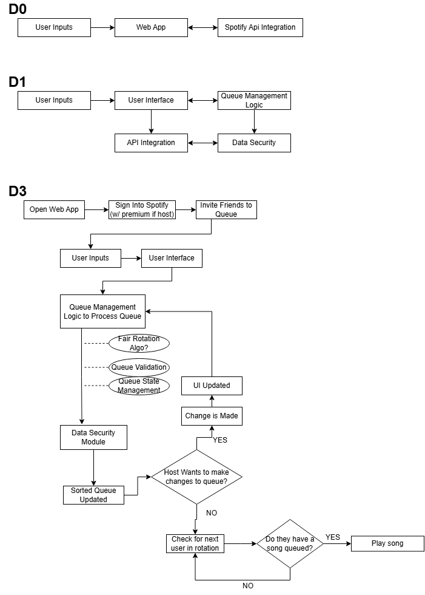

# Final Fall Design Report

## Table of Contents
1. [Team Names and Project Abstract](#team-names-and-project-abstract)
2. [Project Description](#project-description)
3. [User Stories and Design Diagrams](#user-stories-and-design-diagrams)
4. [Project Tasks and Timeline](#project-tasks-and-timeline)
5. [ABET Concerns Essay](#abet-concerns-essay)
6. [PPT Slideshow](#ppt-slideshow)
7. [Self-Assessment Essays](#self-assessment-essays)
8. [Professional Biographies](#professional-biographies)
9. [Budget](#budget)
10. [Appendix](#appendix)

---

## Team Names and Project Abstract
**Team Members:**
- [Trysten Giorgione]\
**Advisor:** [TBA]  

**Abstract:**  
> This project aims to create a web application that improves Spotify’s group listening functionality by implementing fair queue management. Using the Spotify API, our solution will ensure all users in a shared session are equally represented in the song rotation. This approach will enhance user satisfaction and encourage a more enjoyable, balanced experience for group listening. Key aspects include API integration, queue logic design, and a user-friendly interface for selecting queue preferences. This project addresses technical, ethical, and legal constraints associated with fair queue management.

---

## Project Description
> Spotify's Jam feature is great, but could still use some work. Inherintly, the Jam queue is unfair and plays songs chronologically in the order that they were added. This project aims to bring some life to Spotify's Jam feature by allowing for fair rotations amongst users as well as bringing some potential fun features like 'vote_skip' or 'save_played_songs_to_playlist'.

---

## User Stories and Design Diagrams
### User Stories
*“As a user, when I am listening to music with my friends I want everyone to be fairly represented in the songs that play”*\
*“When using Spotify, I think it would be cool if there were different ways of sorting/randomizing queued songs”*

### Design Diagrams

---

## Project Tasks and Timeline
### Task List
*Outline all major tasks and their current status.*  

### Timeline
*Provide a Gantt chart or timeline graphic.*  

### Effort Matrix
*Show the distribution of work hours per team member.*

---

## ABET Concerns Essay
* > In developing a Spotify web application that enhances the “Jam” functionality, several constraints influence the design and implementation of the solution. These constraints include economic, professional, ethical, and legal factors.\
  > \
  > From an economic perspective, the project is limited by the need to rely on free or open-source tools, such as the Spotify API. There is no external funding, so additional costs for hosting or software licenses must be minimized. 
  > This constraint impacts decisions about infrastructure, as the project will use free hosting platforms like Heroku or limited cloud services.\
  > \
  > Professional constraints also shape the project, as this web application aims to showcase technical expertise in software development, web design, and algorithm implementation. The project’s success could positively impact the developer’s portfolio and professional reputation, making it essential to follow best practices and maintain high standards of quality.\
  > \
  > Ethically, the project must ensure fair usage of the Spotify API, particularly in terms of user data privacy. As the application handles user input, it must take precautions to protect user information and ensure that the app complies with privacy regulations. No personal data should be stored unnecessarily, and all interactions with Spotify’s servers should follow their guidelines.\
  > \
  > Lastly, legal constraints play a significant role, as the project depends heavily on Spotify’s intellectual property. The project must adhere to Spotify’s API usage terms, ensuring that the application doesn’t infringe on copyrights or misuse any proprietary data. Any violation of these legal constraints could lead to the termination of API access, which is critical for the app’s functionality.\
*

---

## PPT Slideshow
*[Powerpoint Slideshow](WebbApp_presentation_1.pdf)*

---

## Self-Assessment Essays
*Trysten’s Capstone Assessment:\
> This senior design project is something that I believe is very important for my future. One thing that this project is about to me is utilizing knowledge that I have learned from classes up until now and hardening those skills. Not only knowledge from classes though. I will be able to utilize and harden my skills from Co-Ops and life that I have picked up until now as well. Using these practices and skills all together to create a project will be a great way to demonstrate my capabilities, not only to myself, but potential employers. Additionally, I really think that the project that is in development from Team Apollo could be one that provides a nice benefit to Spotify users, like me, and I look forward to even just being able to utilize it with my friends and family.\
> \
From being a student at the University of Cincinnati (UC), I have learned many skills and concepts which I think will help me guide myself down the proper paths for developing my project. Firstly, as a freshman CEAS student, I participated in two ‘Engineering Design Thinking’ course (ENED-1100 and ENED-1120), which help students in the engineering design/problem solving processes. Having a rough process to follow will be helpful in at least staying on track during this development period. Soft-skills wise, I was also very fortunate to have been in the ‘Software Engineering’ (EECE-3093) class that I was in. In that class we learned how to use many standard development tools and techniques with Git-Hub as a repository. Other than those 2 classes, I also learned many things about databases in ‘Database Design/Development’ (CS-4092), data structures, algorithms in ‘D&A of Algorithms’ (CS-4071), and AI in ‘AI Principles and Applications’ (CS-4033) that will surely be beneficial in making this project.\
> \
In addition to my courses from UC helping me with this future development, my previous Co-Op experiences that I received while at UC are also going to be a great help. For my first 2 Co-Op terms, I was a computer science intern at the company called CIMx. At this company, I got to learn many new skills with work and computer science that I did not get to in classes. For instance, before even having a database class, I got the opportunity to work with CIMx on their flagship product ‘Quantum’, which utilizes a lot of code in SQL. On top of that, I got to harness new skills with JavaScript to help develop the look of the software. After working at CIMx, I did a semester of EEP where I got personally work on a music related project where I had to also manage my time and resources to work on a personal project. I had to find a supervisor to work with, learn new skills in computer engineering design and development (i.e. KiCAD and electrical physics). My final Co-Op was 2 semesters long and was very beneficial to me as a person. I lived abroad in Japan and learned a lot about my character and picked up life skills. Communication is one big one. I had to communicate in a foreign language to do anything. I also had to make friends and get involved in the culture. These personally enlightening experiences coupled with my need to manage my time and resources (since nobody was going to come do it for me) are also going to be very beneficial in this project.\
> \
I am particularly excited to work on this project! I am very passionate about music related things since I play guitar and listen to music all the time, I am really looking forward to developing something that people like me, or even people who aren’t as crazy about music, can enjoy. When I am hanging out with my friends at a house party or having a bonfire, we also start up a Spotify queue, but from firsthand experience I realized it could be better. So, I really want to make this project successful for the sake of me and my friends using it, but with the hope that it can be used by many down the road. Music is very powerful, and it should be enjoyed to its fullest potential. My hopes are that, if I can successfully make a prototype of this software, I can pitch it to Spotify and maybe become a part of the team or something. That would be really big for my career and my future.\
> \
The development of this Spotify web application product might be a little tricky to figure out at first. However, I do have a workflow that I plan to follow. Firstly, I plan to brainstorm the main features I want this application to have. By charting and drawing up my rough ideas on the look and function of this app, I can be more directed in later work. Meaning, I can figure out much more easily and quickly the technical side of this development. I expect to finish with a product that is essentially Spotify+. I do not intend on taking away any features and I want the application to be easy to use if a user has used Spotify before. For self-evaluation, the most I can really do is log my time and be diligent about keeping myself on track. Since I am doing this solo, I will not really have anybody except for my advisor to keep me in line, and the advisor should not be responsible for that anyway. To know I am done working on this project, I need only have developed an app that is visually pleasing and implements a fair queueing system with other sorting methods for Spotify.\*

---

## Professional Biographies
[Trysten Giorgione]:\ 
**Co-op Experience**
\
**• Software Development Intern, CIMx Software, Cincinnati Ohio (2 Semesters):**
> *o	Worked on flagship software Quantum for manufacturing production efficiency\
> o	Worked on software UI using JavaScript\
> o	Interacted with database using SQL to create software functionality that utilizes inventory\
> o	Regression tested the software capabilities before big releases and changes*

**•Data Science Intern, Toyobo, Katata, Otsu, Japan (2 Semesters):**
> o	Interacted with co-workers in Japanese\
> o	Used data science techniques to aid researchers in analyzing research data
> > 	Numpy\
> > 	Pandas\
> > 	Seaborn

**Skills**
> •	**Programming:**    C++, C, Python, SQL, HTML\
> • **Operating Systems:**    Windows\
> • **Office Applications:**    Microsoft Office Package, Clip Studio Paint

**Areas of Interest**\
> •	*Artificial Intelligence*\
> •	*Electrical Physics*\
> •	*Music Production and Animation*
*

---

## Budget
*[Expenses]:
    o Spotify Premium $11.99/month\
*

---

## Appendix
*Include references, citations, links to code repositories, and meeting notes.*  
*Document evidence for 45+ hours of effort per team member.*
