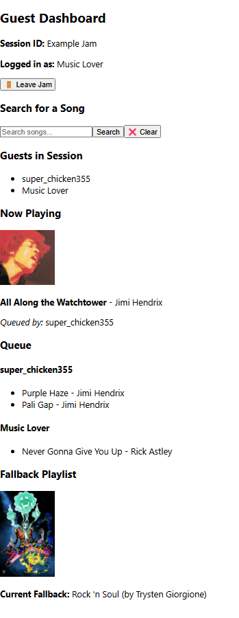

# 🎧 Better Spotify Jam – User Documentation & Manual

---

## 🔧 Installation & Setup Guide

### Requirements
- Spotify Premium account (for the host only)
- Node.js and npm installed
- Git (optional for cloning)
- Chrome/Firefox browser

### Getting Started

1. **Clone the repository**:
   ```bash
   git clone https://github.com/trysteng23/spotify-jam-app.git
   cd spotify-jam-app
   ```

2. **Install backend and frontend dependencies**:
   ```bash
   npm install
   cd frontend
   npm install
   ```

3. **Create a `.env` file in the backend directory** (based on `.env.example`):
   ```
   SPOTIFY_CLIENT_ID=your_id
   SPOTIFY_CLIENT_SECRET=your_secret
   REDIRECT_URI=http://localhost:5000/auth/callback
   ```

4. **Start the application**:
   From the root directory:
   ```bash
   node backend/index.js
   ```
   Then in a separate terminal:
   ```bash
   cd frontend
   npm start
   ```

---

## 🧑‍🏫 How to Use the App

### 1. Setup Playback
- Make sure a device with the host’s Spotify is **on and playing music**
- Ensure **Repeat is turned OFF**

### 2. Launch the App

#### Host:
- From the host device browser, visit: `http://localhost:3000`

#### Guests:
- Must be on **the same Wi-Fi** as the host
- Connect to the host’s **local IP address** at port 3000  
  _Example_: `http://192.168.0.X:3000`

---

### 3. Host a Jam
- Click **"Host a Jam"**
- Enter a **unique session name** to start the session
- The session ID will be available for guests to join

### 4. Join a Jam (Guests)
- Click **"Join a Jam"**
- Enter the **session ID** provided by the host
- Choose a **display name**

---

### 5. Using the Queue System
- **Queue a song** or set a **fallback playlist or album**
- Use the **"Next"** button on the host dashboard to play the next user’s song
- The app will:
  - Rotate through users fairly
  - Use the fallback playlist when no user has songs

📌 **Tip:** It’s always a good idea to set a fallback playlist in advance.

---

### 6. Save the Played Songs as Playlist and End Session
- As the host, click **"End Jam"**
- A pop-up should display asking the host if they would like to save the playlist before ending the jam.
- Selecting **OK** will save the playlist to Spotify as a public playlist with the title **"Jam {date/of/jam}"** and cancel will do nothing
- The next pop-up will make sure the host wants to end the session. Prompting with **OK** and **CANCEL**.

---

## 🖼️ Screenshots

### 1. Landing Page


### 2. Create Session


### 3. Guest Join Screen


### 4a. Host Dashboard


### 4b. Guest Dashboard


### 5. Save Playlist Prompt

---

## ❓ FAQ

**Q: Do I need Spotify Premium to join a session?**  
A: No, only the host needs Premium to control playback.

**Q: Can guests add songs without logging in?**  
A: Yes, guests can queue songs without a Spotify account.

**Q: What happens when the queue is empty?**  
A: The fallback playlist (if set) will play automatically.

**Q: Can we reconnect to a session after leaving?**  
A: Yes, using the session ID and same display name.

**Q: What if I hear no music?**  
A: Make sure the host device is actively playing music and connected.

---

© 2025 – Trysten Giorgione  
Project Advisor: Dr. Fred Annexstein
